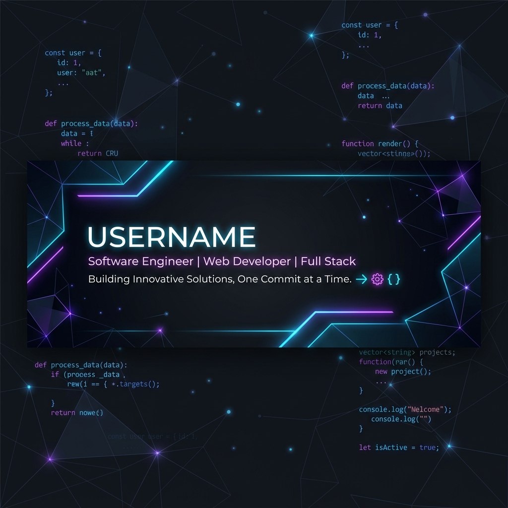

# 👋 Hi, I'm Apurbo Shib!

  

## 🚀 About Me
I'm a passionate **Full-Stack Developer** and **Software Engineer** dedicated to building innovative, high-impact digital solutions. My expertise spans across AI-driven platforms, educational tools, and robust backend architectures. I love solving complex problems and turning ideas into polished, user-centric products.

- 🔭 Currently working on **[Jiggasa AI](https://github.com/ApurboShib)** – A next-gen educational platform.
- 🌱 Specialized in **Legal AI & Document Processing** (OCR, Multilingual Support).
- 🎨 Design Philosophy: **Premium Aesthetics** meets **Functional Simplicity**.
- 💬 Ask me about **FastAPI, React, Docker, or AI Integration**.
- ⚡ Fun fact: I believe a good UI is as important as a solid backend.

---

## 🛠️ Tech Stack

### 🌐 Frontend & Design

### ⚙️ Backend & Database

### 🧰 DevTools & Infrastructure

---

## 📊 GitHub Stats

  

  

---

## 🌟 Featured Projects

### ⚖️ Legal AI Platform
A professional tool for legal drafting and document processing.
- **Key Features:** Multilingual OCR (Bangla support), Automated Template Generation.
- **Tech:** FastAPI, Python, OCR Tesseract.

### 🎓 Jiggasa AI (Education)
A platform dedicated to transforming the NCTB curriculum through interactive storytelling and AI-driven insights.
- **Key Features:** Dynamic curriculum delivery, Interactive Visualizers.
- **Tech:** React, Node.js, PostgreSQL.

---

## 📫 Connect with Me

---

  <i>"Code is poetry, and I'm a poet."</i>

